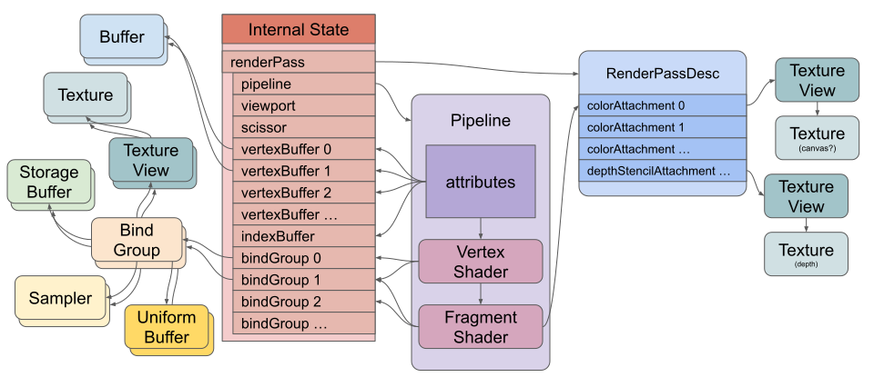

# wgpu_unlit_render和unlit3d

`wgpu_unlit_render`是基于`wgpu`的、紧凑的、有主见的、无光照（unlit）3D渲染器。`unlit3d`是基于`wgpu_unlit_render`的完整的、易用的上层API。

目标硬件为WebGPU，并且移动端优先。不支持WebGL、GLES。

## 功能

功能是有主见的、移动优先的：
- API最终目标是使用一个上下文/状态绘制到一个`TextureView`渲染目标。深度纹理的格式和有无可以配置。
- 支持`egui`，可将`egui`的`FullOutput`转为本库的上下文并且更新上下文，以绘制到渲染目标，但不集成平台输入输出。
- 单个render pass完成所有不透明和透明实例的渲染。
- 默认启用MSAA。MSAA纹理和深度纹理默认是`TRANSIENT_ATTACHMENT`。
- unlit管线默认支持基础色、基础色纹理。支持morph targets和skinning。
- 支持自定义的着色器、管线和绑定组。
- 仅3D，不对2D进行特殊优化。
- 顶点属性是压缩的，位置用Snorm16x4，UV用Snorm16x2，两者配合aabb中心和范围、uv最小值和范围解码。顶点色用Unorm8x4，骨骼索引用Uint16x4，骨骼权重Unorm16x4。
- 默认管线的顶点缓冲可以有4个：一个用于位置，一个用于骨骼索引+权重，一个用于UV+顶点色，一个用于逐实例步进的属性（每实例变换矩阵和基础色，因此材质绑定无需基础色）。
- 不自动实例化，支持手动实例化。
- 渲染何时结束是确定性的，便于快照测试。

不支持：
- 光照、阴影。
- 后处理。

## API设计

### 资源

- 拥抱wgpu，直接管理和使用wgpu的资源。不提供不必要的包装；不提供面向CPU数据管理和同步的上层API。但是可以提供便于创建本库特定GPU资源的结构体和函数，如UBO和SSBO结构体声明、Mesh顶点量化和压缩API。
- 内部用一个状态追踪和管理所有GPU资源及它们的依赖关系，数据结构为有向无环图（`petgraph`）。
- 暴露API以允许获取、替换和移除底层的wgpu资源，并且追踪资源：当资源被替换时，标记其为脏，这也意味着依赖它的资源也需要更新；当资源被移除时，它和依赖它的资源都将被移除。
  资源状态的追踪是精准，更新是延迟的，用户调用特定API来使更新资源状态，如在buffer扩容后更新依赖它的绑定组。



### 绘制/RenderPass

绘制过程，即render pass，也遵循数据驱动，用一个声明式的数据结构描述绘制过程所使用的资源及依赖，以允许用户进行自定义、hook和修改。

绘制过程伪代码：
```rust
for pipeline in scene.pipelines {
    pass.set_pipeline(pipeline); // builtin unlit pipeline, and custom.

    // By default, there is 1 global binding in index 0.
    for (idx, global_binding) in pipeline.bindings {
        pass.set_bind_group(idx, global_binding);  // camera, globals (time, delta, frame count), mesh metadata (vertex decoding metadata, morph targets info), and custom.
    }

    for material in pipeline.materials {
        // By default, there is 0 or 1 material binding in index 1.
        for (idx, material_binding) in material.bindings {
            pass.set_bind_group(idx, material_binding); // base color texture, and custom.
        }

        for mesh in material.meshes {
            // By default, there is 1 mesh binding in index 2.
            for (idx, mesh_binding) in mesh.bindings {
                pass.set_bind_group(idx, mesh_binding); // mesh metadata index, joint matrices, morph deltas, morph weights, and custom.
            }

            // By default, there is 3 or 4 vertex buffers: position, uv+color, instance data, and optional joint index+joint weight
            for (idx, vertex_buffer) in mesh.vertex_buffers {
                pass.set_vertex_buffer(idx, vertex_buffer); // per-vertex attributes, per-instance model transform, base color, and custom.
            }

            if let Some(index_buffer) = mesh.index_buffer {
                pass.set_index_buffer(index_buffer);
                pass.draw_indexed(mesh.index_range, mesh.base_vertex, mesh.instance_range);
            } else {
                pass.draw(mesh.vertex_range, mesh.instance_range);
            }
        }
    }
}

```

作为优化：在循环中，快速比较本次循环设置的资源和上次循环设置的资源是否相等，若相等可避免循环中频繁的状态切换。

### 上层API

上层API在`unlit3d`包中实现，并且依赖于`wgpu_unlit_render`。

基本需求：
- 拓展性和移植性。要将自身视作游戏引擎一部分，考虑架构、拓展性，便于与其他功能如物理、音频等集成。
- 对于公开API，优先使用dyn trait而不是静态分发来提高灵活性和拓展性，不要过分担心性能。
- 一定程度考虑多线程。
- 易用性，根据CPU场景数据同步至GPU缓冲并渲染。
- 允许底层控制，能绕过CPU数据直接更新GPU缓冲。
- 采用CPU视锥剔除。

反思其他引擎的做法：
- bevy，采用ECS架构，好的地方：模块化程度高，插件的拓展性好，ECS能充分利用多线程。不好的地方：
  主要来自ECS的缺点和复杂性：组件之间的依赖关系导致易出错，继承和复用不够明显，复杂对象状态管理困难，场景图用组件表示不如直接用树数据结构和对象表示直观。一些例子：
  1.组件变化检测机制复杂、易失效、易出错，组件依赖更新和派生机制几乎没有。如果每帧同步而不保留组件，开销可能较大。而如果保留组件，则涉及复杂的变化检测和依赖更新问题。例：`bevy_render`的资源提取模式易出错，尤其是在组件增删时，容易泄漏衍生组件，容易漏掉更新或使变化检测失效导致过度更新。复杂性体现在bevy的渲染系统往往很庞大，可能要处理大量组件，并带有大量`Changed`、`RemovedComponents`查询。而在OOP中，对象自身状态在内部维护。
  2.拓展性体现在系统的相加上，而不在组件上，组件缺乏OOP的继承性。例：bevy的材质拓展需要用户为每个自定义材质注册一个插件，较繁琐。bevy的材质所需的GPU句柄往往绑死了`ShaderBuffer`，`Mesh`，`Image`等类型的Handle，用户无法自定义自己的资源句柄用于材质。而这在OOP中，用基类并拓展非常容易。
  由于渲染资源类型单一，bevy的`RenderAssetUsages`机制也易出错：主世界被提取了渲染资源的数据后，再访问它就会报错。
- Godot、Three.js等，采用OOP、场景树/图和中心化渲染器，好的地方：易用性好，Godot的场景树轻松可以拆分和组合。API可以非常上层（如Godot的节点树），也可以比较底层（如Godot的服务器模式）。不好的地方：
  1.对于Rust来说，OOP和继承不方便，强行模拟OOP很别捏。
  1.不擅长处理大量实体，遍历节点树开销较高。2.不像ECS那样自动和充分利用并行。并行是粗粒度的，需要手动调整。Godot的并行体现在服务器、节点的每帧更新逻辑可以选择后台线程，服务器和节点内部逻辑不能并行，除非手动调用线程池。

功能提议：
- ECS，即unlit_ecs库
  - ECS框架保持精简，用Archetype储存，目前没有用到的功能绝不添加。
  - 没有变化检测、组件钩子等。
  - 没有资源。资源是标记组件。资源实体可被所有行为组件访问，无视数据隔离。资源引用是实体引用。
  - 实体上的组件默认不能运行时增删，只能读写，要改变实体上的组件种类必须despawn再重新spawn。但允许组件设置为可运行时增删。
  - 实体用Children，ChildOf组件引用其他实体表示父子关系。这两个组件可以增删。
  - 没有系统（借鉴自`hecs`）。系统只是外部调用者对世界的访问，或是包含行为（闭包函数）的组件。
    因此不用做复杂的系统并行性（依赖、访问冲突等）分析、多线程调度器。让外部调用者自行决定运行的线程。
  - 支持async。行为组件内的函数是async的。
  - 行为组件由外部调用者访问世界来驱动，并且行为组件可以实现类似Godot的节点内部的帧更新、固定间隔更新、按键鼠标触摸输入等回调。
  - 数据隔离：行为组件的调用时仅可访问自身实体和孩子实体上的数据，不能访问父实体。实体像OOP的对象那样做好数据隔离。
  - 实体可以注册事件和观察者。用户可以借鉴类似Godot的“对上传递事件，对下调用方法”的signal模式。对父实体可以发送事件，对孩子实体可以调用行为组件。
  - `!Send`世界和`Send`世界分离，两者用channel传递数据。只有`Send`世界的组件才是`Send`，`!Send`世界只能在主线程运行。GPU资源和渲染器是`!Send`组件，为了兼容`wasm32`。

- 渲染，即unlit3d库
  - render世界系统驱动渲染。渲染器是组件，在render系统中渲染所有带有renderable组件的孩子实体，并输出到render target上（纹理或交换链）。相机是渲染器的一个数据组件。

## 实施计划

- [x] `wgpu`资源管理、基本的pipeline和mesh绘制API、unlit管线。
- [x] 支持`egui`。
- [ ] 设计并实施上层API
- [ ] 支持skinning和morph targets。

提示：
- 字节转换统一用`zerocopy`。
- 着色器预处理用`wesl`。
- mesh顶点压缩可参考<https://github.com/bevyengine/bevy/blob/main/crates/bevy_render/src/utils.wesl>，<https://github.com/bevyengine/bevy/blob/main/crates/bevy_mesh/src/mesh.rs>，<https://github.com/bevyengine/bevy/blob/main/crates/bevy_mesh/src/vertex.rs>，<https://github.com/bevyengine/bevy/pull/24616>，虽然我们不需要法线和切线，但我们仍然可以提供它们供用户使用。

## 测试

添加GPU集成测试，回读渲染纹理的结果，并保存为图像作为快照，使用图像差异算法库（如`fast-ssim2`）比较图像差异。
